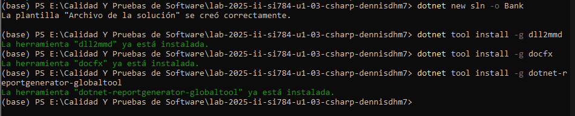
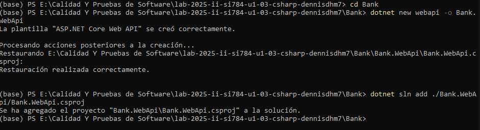
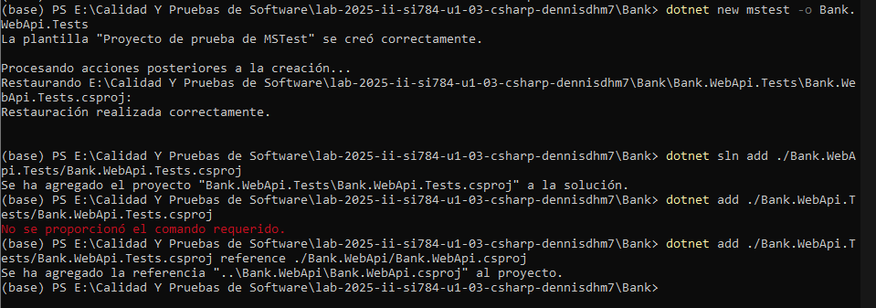
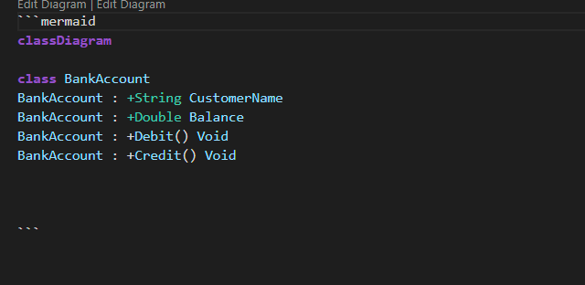
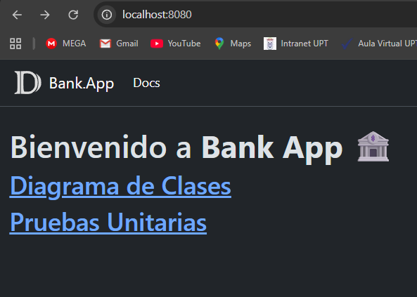
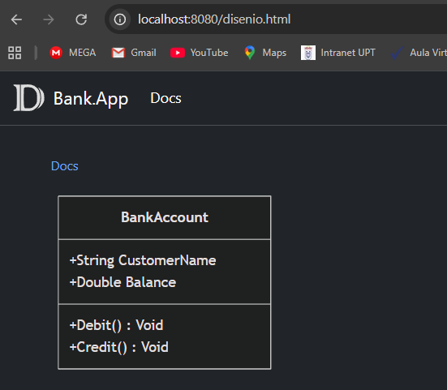
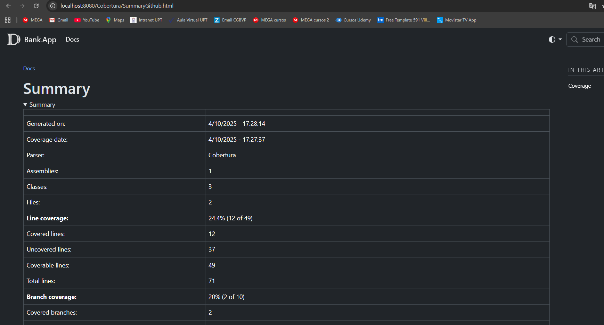
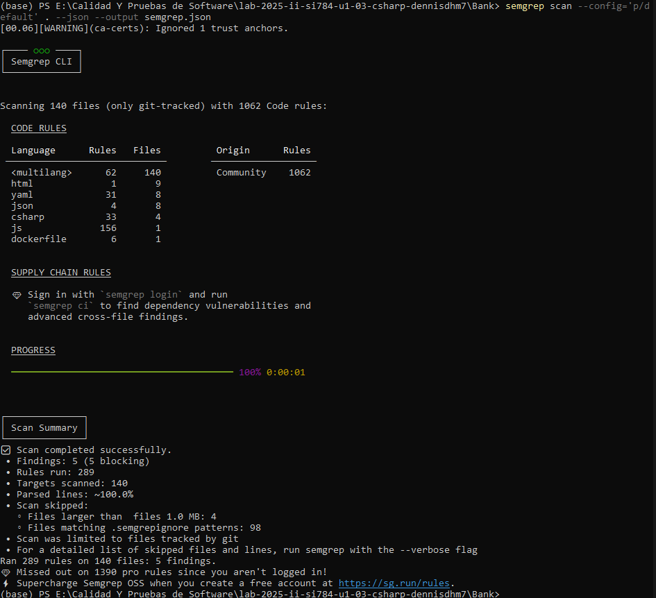
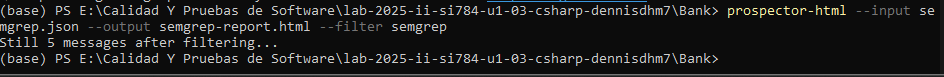
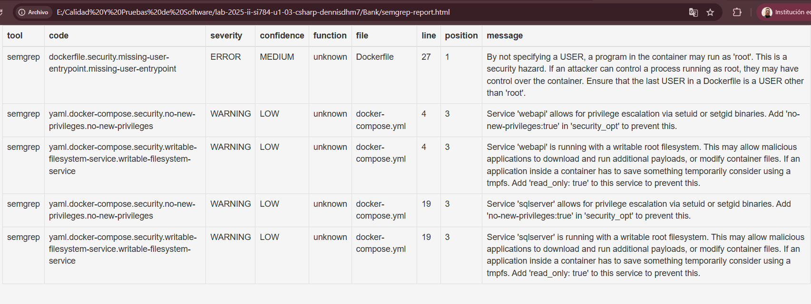

[](https://classroom.github.com/a/6iqWfv8G)
[](https://classroom.github.com/open-in-codespaces?assignment_repo_id=20895268)
# SESION DE LABORATORIO N° 03: PRUEBAS ESTATICAS DE SEGURIDAD DE APLICACIONES CON SEMGREP

# Nombres  y Apellidos: Christian Dennis Hinojosa Mucho

## OBJETIVOS
  * Comprender el funcionamiento de las pruebas estaticas de seguridad de còdigo de las aplicaciones que desarrollamos utilizando Semgrep.

## REQUERIMIENTOS
  * Conocimientos: 
    - Conocimientos básicos de Bash (powershell).
    - Conocimientos básicos de Contenedores (Docker).
  * Hardware:
    - Virtualization activada en el BIOS..
    - CPU SLAT-capable feature.
    - Al menos 4GB de RAM.
  * Software:
    - Windows 10 64bit: Pro, Enterprise o Education (1607 Anniversary Update, Build 14393 o Superior)
    - Docker Desktop 
    - Powershell versión 7.x
    - Python 3.1x o superior
    - Net 8 o superior
    - Visual Studio Code

## CONSIDERACIONES INICIALES
  * Clonar el repositorio mediante git para tener los recursos necesarios
  * Tener una cuenta de Github valida. 

## DESARROLLO
### Parte I: Configuración de la herramienta de Pruebas Estaticas de Seguridad de la Aplicación
1. Iniciar la aplicación Powershell o Windows Terminal en modo administrador 
2. En el terminal, ejecutar los siguientes comandos para instalar SEMGREP.
```Bash
python -m pip install semgrep
python -m pip install prospector2html
```
3. Cerrar el terminal para que se actualicen las variables de entorno.

### Parte II: Creación de la aplicación
1. Iniciar la aplicación Powershell o Windows Terminal en modo administrador. 
2. En el terminal, Ejecutar el siguiente comando para crear una nueva solución
```
dotnet new sln -o Bank
dotnet tool install -g dll2mmd
dotnet tool install -g docfx
dotnet tool install -g dotnet-reportgenerator-globaltool
```



3. En el terminal, Acceder a la solución creada y ejecutar el siguiente comando para crear una nueva libreria de clases y adicionarla a la solución actual.
```
cd Bank
dotnet new webapi -o Bank.WebApi
dotnet sln add ./Bank.WebApi/Bank.WebApi.csproj
```



4. En el terminal, Ejecutar el siguiente comando para crear un nuevo proyecto de pruebas y adicionarla a la solución actual
```
dotnet new mstest -o Bank.WebApi.Tests
dotnet sln add ./Bank.WebApi.Tests/Bank.WebApi.Tests.csproj
dotnet add ./Bank.WebApi.Tests/Bank.WebApi.Tests.csproj reference ./Bank.WebApi/Bank.WebApi.csproj
```



5. Iniciar Visual Studio Code (VS Code) abriendo el folder de la solución como proyecto. En el proyecto Bank.Domain, si existe un archivo Class1.cs proceder a eliminarlo. Asimismo en el proyecto Bank.Domain.Tests si existiese un archivo UnitTest1.cs, también proceder a eliminarlo.

6. En el Visual Studio Code, en el proyecto Bank.WebApi proceder la carpeta `Models` y dentro de esta el archivo BankAccount.cs e introducir el siguiente código:
```C#
namespace Bank.WebApi.Models
{
    public class BankAccount
    {
        private readonly string m_customerName;
        private double m_balance;
        private BankAccount() { }
        public BankAccount(string customerName, double balance)
        {
            m_customerName = customerName;
            m_balance = balance;
        }
        public string CustomerName { get { return m_customerName; } }
        public double Balance { get { return m_balance; }  }
        public void Debit(double amount)
        {
            if (amount > m_balance)
                throw new ArgumentOutOfRangeException("amount");
            if (amount < 0)
                throw new ArgumentOutOfRangeException("amount");
            m_balance -= amount;
        }
        public void Credit(double amount)
        {
            if (amount < 0)
                throw new ArgumentOutOfRangeException("amount");
            m_balance += amount;
        }
    }
}
```
7. En el Visual Studio Code, en el proyecto Bank.WepApi.Tests añadir un nuevo archivo BanckAccountTests.cs e introducir el siguiente código:
```C#
using Bank.WebApi.Models;
using NUnit.Framework;

namespace Bank.Domain.Tests
{
    public class BankAccountTests
    {
        [Test]
        public void Debit_WithValidAmount_UpdatesBalance()
        {
            // Arrange
            double beginningBalance = 11.99;
            double debitAmount = 4.55;
            double expected = 7.44;
            BankAccount account = new BankAccount("Mr. Bryan Walton", beginningBalance);
            // Act
            account.Debit(debitAmount);
            // Assert
            double actual = account.Balance;
            Assert.AreEqual(expected, actual, 0.001, "Account not debited correctly");
        }
    }
}
```
8. En el Visual Studio Code, en la raiz del proyecto crear un archivo Dockerfile con el siguiente contenido:
```Yaml
FROM mcr.microsoft.com/dotnet/aspnet:8.0 AS base
WORKDIR /app
EXPOSE 80

FROM mcr.microsoft.com/dotnet/sdk:8.0 AS build
WORKDIR /src
COPY . .
WORKDIR "/src/."
RUN dotnet restore 
RUN dotnet build -o /app/build

FROM build AS publish
RUN dotnet publish -o /app/publish /p:UseAppHost=false

FROM base AS final
WORKDIR /app
COPY --from=publish /app/publish .
ENTRYPOINT ["dotnet", "Bank.WebApi.dll"]
```
9. En el Visual Studio Code, en la raiz del proyecto crear un archivo docker-compose.yml con el siguiente contenido:
```Yaml
version: '3.4'
services:
  webapi:
    image: api-bank
    build:
      context: .
    ports:
        - ${APP_HOST}:80
    environment:
        - "ConnectionStrings__DefaultConnection=Server=${DB_SERVER},${DB_PORT};Initial Catalog=${DB_NAME};Persist Security Info=False;User ID=${DB_USERNAME};Password=${DB_PASSWORD};MultipleActiveResultSets=False;Encrypt=True;TrustServerCertificate=${TRUST_SERVER_CERTIFICATE}; Integrated Security=${INTEGRATED_SECURITY};Connection Timeout=30;"
    depends_on:
        - "sqlServer"
    links:
        - "sqlServer"

  sqlServer:
    image: mcr.microsoft.com/mssql/server:2022-latest
    hostname: "sqlserver"
    environment:
        SA_PASSWORD: ${DB_PASSWORD}
        ACCEPT_EULA: "Y"
    restart: always
    ports:
        - "${DB_PORT}:1433"
```

10. En el terminal, ejecutar el siguiente comando para ejecutar las pruebas unitarias y el reporte de cobertura
```Bash
dotnet test --collect:"XPlat Code Coverage"
ReportGenerator "-reports:./*/*/*/coverage.cobertura.xml" "-targetdir:Cobertura" -reporttypes:MarkdownSummaryGithub
``` 

11. En el terminal, ejecutar el siguiente comando para optener el diagrama de clases.
```Bash
dll2mmd -f Bank.WebApi/bin/Debug/net8.0/Bank.WebApi.dll -o disenio.md
``` 



12. En el terminal, ejecutar el siguiente comando para generar el diagrama de clases respectivo
```Bash
docfx init -y
```
13. En el Visual Studio Code, eliminar los archivos de la carpeta o directorio docs, seguidamente modificar los archivos con el siguiente contenido:
> docfx.json
```Json
{
  "$schema": "https://raw.githubusercontent.com/dotnet/docfx/main/schemas/docfx.schema.json",
  "metadata": [
    {
      "src": [
        {
          "src": ".",
          "files": [
            "**/*.csproj"
          ]
        }
      ],
      "dest": "docs"
    }
  ],
  "build": {
    "content": [
      {
        "files": [
          "**/*.{md,yml}"
        ],
        "exclude": [
          "_site/**"
        ]
      }
    ],
    "resource": [
      {
        "files": [
          "images/**"
        ]
      }
    ],
    "output": "_site",
    "template": [
      "default",
      "modern"
    ],
    "globalMetadata": {
      "_appName": "Bank.App",
      "_appTitle": "Bank App",
      "_enableSearch": true,
      "pdf": true
    }
  }
}
```
> toc.yml
```Yaml
- name: Docs
  href: docs/
```
> index.md
```Markdown
---
_layout: landing
---

# This is the **HOMEPAGE**.

## [Diagrama de Clases](disenio.md)

## [Pruebas](Cobertura/SummaryGithub.md)
```
14. En el terminal, ejecutar el siguiente comando para generar la documentacion
```Bash
docfx metadata docfx.json
docfx build
docfx serve _site
```








15. En el terminal, ejecutar el(los) siguiente(s) comando(s) para realizar el analisis de codigo:
```Bash
semgrep scan --config='p/default' . --json --output semgrep.json
prospector-html --input semgrep.json --output semgrep-report.html --filter semgrep
```





16. En el paso anterior se genero un archivo `semgrep-report.html` el cual contiene el resultado del analisis que deberia ser similar a lo siguiente:



17. En el VS Code, proceder a crear la carpeta .github/workflow y dentro de esta crear el archivo semgrep.yml con el siguiente contenido.
```Yaml
name: Semgrep Analysis
env:
  DOTNET_VERSION: '8.x'                     # la versión de .NET
on: push
jobs:
  security:
    runs-on: ubuntu-latest
    container:
      # A Docker image with Semgrep installed. Do not change this.
      image: semgrep/semgrep
    steps:
      - uses: actions/checkout@v4
      - uses: snyk/actions/setup@master
      # - name: Configurando la versión de NET
      #   uses: actions/setup-dotnet@v4
      #   with:
      #     dotnet-version: ${{ env.DOTNET_VERSION }}  
      - name: Semgrep scan
        run: semgrep scan --config="p/default" --sarif --output=report.sarif --metrics=off
      - name: Upload result to GitHub Code Scanning
        uses: github/codeql-action/upload-sarif@v3
        with:
          sarif_file: report.sarif
```

---
## Actividades Encargadas
1. Adicionar al archivo de semgrep.yml los pasos necesarios para generar el reporte en formato HTML y publicarlo dentro de un Github Page

```Yaml
name: Semgrep Analysis

env:
  DOTNET_VERSION: '9.x'

on:
  push:
    branches:
      - main
  pull_request:

jobs:
  security:
    runs-on: ubuntu-latest
    container:
      image: semgrep/semgrep

    steps:
      # 🧩 1. Checkout del código fuente
      - name: Checkout repository
        uses: actions/checkout@v4

      # 🐍 2. Instalar Python y prospector2html (en entorno aislado)
      - name: Install prospector2html
        run: |
          apk add --no-cache python3 py3-pip
          python3 -m venv /tmp/venv
          . /tmp/venv/bin/activate
          pip install --no-cache-dir prospector2html
        shell: bash

      # 🔎 3. Ejecutar Semgrep y generar reporte JSON
      - name: Run Semgrep scan
        run: |
          . /tmp/venv/bin/activate
          semgrep scan --config="p/default" --json --output=semgrep.json --metrics=off || true
        shell: bash

      # 🧾 4. Convertir reporte JSON a HTML (maneja errores de salida)
      - name: Generate HTML report
        run: |
          . /tmp/venv/bin/activate
          if [ -f semgrep.json ]; then
            echo "🔧 Generando reporte HTML desde semgrep.json..."
            prospector-html --input semgrep.json --output semgrep-report.html --filter semgrep || true
            echo "✅ Reporte HTML generado correctamente."
          else
            echo "⚠️ No se encontró semgrep.json, saltando generación de HTML."
          fi
        shell: bash

      # 📦 5. Subir el reporte HTML como artefacto
      - name: Upload Semgrep HTML report
        uses: actions/upload-artifact@v4
        with:
          name: semgrep-report
          path: semgrep-report.html
        if: success() || always()  # sube el archivo aunque haya advertencias

      # 🌐 6. Publicar el reporte HTML en GitHub Pages
      - name: Deploy Semgrep report to GitHub Pages
        if: github.ref == 'refs/heads/main'
        uses: peaceiris/actions-gh-pages@v3
        with:
          github_token: ${{ secrets.GITHUB_TOKEN }}
          publish_branch: gh-pages
          publish_dir: .
          destination_dir: semgrep-report
          force_orphan: true  # ⚡ evita conflictos con otras publicaciones
          full_commit_message: "🔍 Updated Semgrep security analysis report"

```

2. Completar la documentación de todas las clases y generar una automatizaciòn .github/workflows/publish_docs.yml (Github Workflow) utilizando DocFx (init, metadata y build) y publicar el site de documentaciòn generado en un Github Page.

```Yaml
name: Publish Documentation

on:
  push:
    branches: [ "main" ]

jobs:
  build-docs:
    runs-on: ubuntu-latest

    steps:
      # 1️⃣ Descargar el código del repositorio
      - name: Checkout repository
        uses: actions/checkout@v4

      # 2️⃣ Instalar .NET 9
      - name: Setup .NET
        uses: actions/setup-dotnet@v4
        with:
          dotnet-version: '9.x'

      # 3️⃣ Instalar DocFX
      - name: Install DocFX
        run: |
          dotnet tool install -g docfx
          echo "$HOME/.dotnet/tools" >> $GITHUB_PATH

      # 4️⃣ Generar metadatos
      - name: Generate metadata
        run: docfx metadata docfx.json
        working-directory: ./Bank

      # 5️⃣ Compilar documentación
      - name: Build documentation
        run: docfx build
        working-directory: ./Bank

      # 🧹 5.5 Limpiar branch gh-pages (previene error de referencia bloqueada)
      - name: Reset gh-pages branch
        run: |
          git fetch origin gh-pages || true
          git push origin --delete gh-pages || true

      # 6️⃣ Publicar en GitHub Pages
      - name: Publish documentation to GitHub Pages
        uses: peaceiris/actions-gh-pages@v3
        with:
          github_token: ${{ secrets.GITHUB_TOKEN }}
          publish_dir: ./Bank/_site
          publish_branch: gh-pages
          force_orphan: true
          destination_dir: docs
          full_commit_message: "📘 Updated documentation site via DocFX"
          user_name: github-actions[bot]
          user_email: github-actions[bot]@users.noreply.github.com

```

3. Generar una automatización de nombre .github/workflows/package_nuget.yml (Github Workflow) que ejecute:
   * Pruebas unitarias y reporte de pruebas automatizadas
   * Realice el analisis con SonarCloud.
   * Contruya un archivo .nuget a partir del proyecto Bank.WebApi y lo publique como un Paquete de Github

```Yaml
name: Build, Test, Analyze and Publish NuGet Package

env:
  DOTNET_VERSION: '9.x'
  SONAR_TOKEN: ${{ secrets.SONAR_TOKEN }}
  GITHUB_TOKEN: ${{ secrets.GITHUB_TOKEN }}
  GITHUB_PACKAGES_SOURCE: "https://nuget.pkg.github.com/${{ github.repository_owner }}/index.json"

on:
  push:
    branches: [ "main" ]

permissions:
  contents: read
  packages: write
  actions: read

jobs:
  build-test-analyze:
    runs-on: ubuntu-latest

    steps:
      # 🧩 1. Checkout del repositorio
      - name: Checkout repository
        uses: actions/checkout@v4

      # ⚙️ 2. Instalar .NET SDK
      - name: Setup .NET
        uses: actions/setup-dotnet@v4
        with:
          dotnet-version: ${{ env.DOTNET_VERSION }}

      # 📦 3. Restaurar dependencias
      - name: Restore dependencies
        run: dotnet restore Bank/Bank.sln

      # 🧪 4. Compilar en modo Release
      - name: Build solution
        run: dotnet build Bank/Bank.sln --configuration Release --no-restore

      # 🧭 5. Ejecutar pruebas unitarias con cobertura
      - name: Run Unit Tests with Coverage
        shell: bash
        run: |
          mkdir -p Bank/Bank.WebApi.Tests/TestResults
          dotnet test Bank/Bank.WebApi.Tests/Bank.WebApi.Tests.csproj \
            --no-build \
            --configuration Release \
            --logger "trx;LogFileName=TestResults/test_results.trx" \
            /p:CollectCoverage=true \
            /p:CoverletOutputFormat=cobertura \
            /p:CoverletOutput=Bank/Bank.WebApi.Tests/TestResults/coverage

      # 🔍 6. Analizar con SonarCloud
      - name: SonarCloud Scan
        uses: SonarSource/sonarqube-scan-action@v5.0.0
        env:
          SONAR_TOKEN: ${{ env.SONAR_TOKEN }}
        with:
          args: >
            -Dsonar.organization=cdhm
            -Dsonar.projectKey=dennisdhm7_lab-2025-ii-si784-u1-03-csharp-dennisdhm7
            -Dsonar.host.url=https://sonarcloud.io
            -Dsonar.cs.opencover.reportsPaths=Bank/Bank.WebApi.Tests/TestResults/coverage.opencover.xml

      # 📦 7. Empaquetar NuGet
      - name: Pack NuGet Package
        run: |
          dotnet pack Bank/Bank.WebApi/Bank.WebApi.csproj -c Release -o out /p:GeneratePackageOnBuild=true

      # 🚀 8. Publicar en GitHub Packages
      - name: Publish NuGet to GitHub Packages
        run: |
          if ls out/*.nupkg 1> /dev/null 2>&1; then
            dotnet nuget push "out/*.nupkg" \
              --source "${{ env.GITHUB_PACKAGES_SOURCE }}" \
              --api-key ${{ env.GITHUB_TOKEN }} \
              --skip-duplicate
          else
            echo "❌ No se encontró ningún paquete NuGet en la carpeta 'out'. Verifica el paso de pack.'"
            exit 1
          fi

```
  
4. Generar una automatización de nombre .github/workflows/release_version.yml (Github Workflow) que contruya la version (release) del paquete y publique en Github Releases e incluya pero ahi no esta el test unitarios

```Yaml
name: Release Version

on:
  push:
    tags:
      - 'v*.*.*'
  workflow_dispatch:

permissions:
  contents: write
  packages: read

jobs:
  create-release:
    runs-on: ubuntu-latest

    steps:
      - name: Checkout repository
        uses: actions/checkout@v4

      - name: Setup .NET
        uses: actions/setup-dotnet@v4
        with:
          dotnet-version: '9.x'

      - name: Restore dependencies
        run: dotnet restore Bank/Bank.WebApi/Bank.WebApi.csproj

      - name: Build project
        run: dotnet build Bank/Bank.WebApi/Bank.WebApi.csproj -c Release --no-restore

      - name: Pack NuGet package
        run: dotnet pack Bank/Bank.WebApi/Bank.WebApi.csproj -c Release -o out --no-build

      - name: Create GitHub Release
        uses: softprops/action-gh-release@v2
        with:
          files: out/*.nupkg
        env:
          GITHUB_TOKEN: ${{ secrets.GITHUB_TOKEN }}

```

